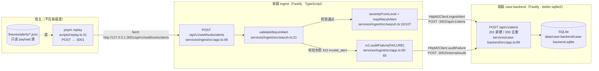

```mermaid
flowchart LR
    subgraph HOST["宿主（不在容器里）"]
        PNP["pnpm replay<br/>scripts/replay.ts:31<br/>POST → :3001"]
        FX[("fixtures/alerts/*.json<br/>只读 payload 源")]
    end

    subgraph ING["容器 ingest（Fastify · TypeScript）"]
        WH["POST /api/v1/webhooks/alerts<br/>services/ingest/src/app.ts:48"]
        VAL["validateWazuhAlert<br/>services/ingest/src/wazuh.ts:21"]
        MAP["severityFromLevel + mapWazuhAlert<br/>services/ingest/src/wazuh.ts:10/107"]
        AUD["m2.auditFailure(FAILURE)<br/>services/ingest/src/app.ts:60-65"]
    end

    subgraph CB["容器 case-backend（Fastify · better-sqlite3）"]
        INGEST["POST /api/v1/alerts<br/>201 新建 / 200 去重<br/>services/case-backend/src/app.ts:89"]
        SQL[("SQLite<br/>data/case-backend/case-backend.sqlite")]
    end

    PNP -- "fetch http://127.0.0.1:3001/api/v1/webhooks/alerts" --> WH
    FX -. "读" .-> PNP

    WH --> VAL
    VAL -- "校验失败 422 invalid_alert" --> AUD
    VAL -- "校验通过" --> MAP
    MAP -- "HttpM2Client.ingestAlert<br/>POST :3002/api/v1/alerts" --> INGEST
    INGEST --> SQL

    AUD -- "HttpM2Client.auditFailure<br/>POST :3002/internal/audit" --> INGEST
```