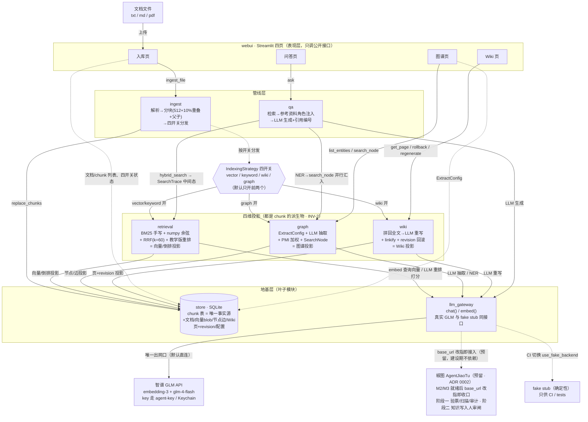

# 架构图 v1 · WeKnora 复刻（2026-09-10，与 specs/modules.md 同批过审）

> mermaid 简版（sdd-flow 学习项目裁剪允许）。模块边界与依赖方向以 `specs/modules.md` 为真源，本图是其投影。
> 带用户过图方式：先看两条主链（入库链、查询链），再看三个安全防线落点，最后看四开关。

## 两条主链（跟着数据走）

- **入库链**：文档文件 → `ingest` 解析分块（512 token + 10% 重叠 + 父子块）→ `store.replace_chunks` 落 chunk 表（唯一事实源）→ 按四开关分发：`retrieval` 建向量/倒排投影、`graph` 抽实体关系建图谱投影、`wiki` 重写出 Wiki 投影——四维投影全部回写 store，全部可由 chunk 重建（INV-2）。
- **查询链**：问答页 → `qa.ask` → `retrieval.hybrid_search` 拿回 `SearchTrace` 四份中间态（双路召回/融合分/重排后），同时 `graph` 做问题 NER→SearchNode 把关系链并行汇入 → 命中子块扩展取父块上下文（INV-1）→ 以"参考资料"角色注入 → `llm_gateway.chat` 生成带引用编号的回答。

## 逐节点一句话

| 节点 | 一句话 |
|---|---|
| `webui` | Streamlit 四页观察窗，纯表现层；写操作走管线模块，列表类只读查询直连 `store`。 |
| `ingest` | 入库管线与四开关分发枢纽，对位 WeKnora `knowledge_post_process.go:83 Handle`；自己不建索引，只按开关调用各管线。 |
| `retrieval` | 手写 BM25（k1/b 真算）+ numpy 暴力余弦 + RRF(k=60) + LLM 打分教学版重排；索引投影的唯一写入面（INV-1：父块只入库不索引）。 |
| `graph` | ExtractConfig schema 引导的逐 chunk LLM 抽取（schema 外类型丢弃）+ PMI×0.6+强度×0.4 加权 + SearchNode 图查询。 |
| `wiki` | chunk 拼回全文（重叠去重、32K 截断）→ LLM 重写 Markdown 页 → linkify 交叉链接+入口页 → revision 一键回滚。 |
| `qa` | 查询编排：检索+图谱并行汇入 → 参考资料角色注入 → 生成带引用编号的回答；`Answer` 携 trace/citations/graph_hits 供页面渲染。 |
| `store` | SQLite 唯一持久化口；chunk 表是唯一事实源（INV-2），向量/图谱/Wiki 全是它的派生投影；共享 dataclass 从这里导出。 |
| `llm_gateway` | 全项目唯一出网口：真实 GLM API 与 fake stub 同接口，业务代码禁直连厂商 SDK（PRD §0.2-3）。 |
| `智谱 GLM API` | embedding-3（2048 维）+ glm-4-flash；key 经 `agent-key glm` 从 Keychain 取，不落库不进日志。 |
| `fake stub` | 确定性假后端，CI 不花钱不抖动；只许 tests/ 调用（边界规则第 6 条）。 |
| `椒图（预留）` | 同仓库安全网关（AgentJiaoTu）；M2/M3 就绪后 base_url 改指即完成"阶段一收口"，知识写入人审闸=阶段二（M3 投毒防护）。界内防线一件不拆，跨界防线椒图叠加（PRD §6.3）。 |

## 安全防线落点（本仓库主旋律，PRD §6）

1. **gateway 是唯一出网口**：所有 LLM/embedding 流量收口在 `llm_gateway`——key 管理、后端切换、调用计量只有一处可查，业务模块没有第二个出网通道。
2. **引用标记 = 指令与数据分离**：`qa` 把检索内容以"参考资料"角色注入并强制引用编号（书 3.4 第一层防御的教学版实现）——它不是 UI 装饰，是安全机制落点。
3. **投毒爆炸半径按维度隔离**：改 chunk → 四维全污染需重入库；只改图谱/Wiki → 只污染该维度（DelGraph 重抽 / revision 回滚）；四开关面板（阶段 13）就是这个隔离性的演示台。
4. **椒图接入预留（v1.1）**：gateway 的 OpenAI 兼容 + base_url 可配是唯一接入面——椒图 M2/M3 就绪后跨界防线（验票/扫描/审计/知识写入人审闸）以改配置方式叠加，界内防线不动（防御分工矩阵见 PRD §6.3）。

## 四开关位置

IndexingStrategy 存于 `store`（每 KB 一份），`ingest` 入库时读取并分发——关掉 vector 后重入库，问答页 kitty→cat 命中消失（30 秒演示主线，PRD 页面清单节）。四开关只影响**入库时的投影生产**，查询时缺哪个维度就走哪条路，系统照样跑。
